# TASKS.MD - SOURCE OF TRUTH

## PROJECT STATUS
- **Status**: BUILD MODE - Level 3 Implementation (Phase 2 - Data Collection)
- **Current Mode**: BUILD (Level 3 Complex System - Phased Implementation)
- **Current Phase**: Phase 2 - Data Collection Service (Python Implementation)
- **Previous Phase**: ✅ Phase 1 - Foundation Phase (COMPLETED)
- **Next Mode**: REFLECT (After All Phases Complete)

## CURRENT TASK - IMPLEMENTATION
**Task**: Implement Three-Tier GoMafia Analytics System with Prisma ORM
**Implementation Phase**: Phase 1 - Foundation Phase
**Focus**: Database Foundation + Prisma Setup

## CREATIVE PHASES STATUS - COMPLETED ✅
✅ **All 5 Creative Phases Complete**
- [x] 🔷 Prisma Schema Design Phase - Hybrid schema with computed fields
- [x] 🗄️ Database Architecture Phase - Strategic SQL + Prisma with caching
- [x] 🐍 Data Collection Architecture Phase - Smart event-driven collection with identity resolution  
- [x] 🎨 UI/UX Design Phase - Professional adaptive dashboard
- [x] 🏗️ System Architecture Phase - Three-tier Prisma-coordinated architecture

## IMPLEMENTATION STATUS - ACTIVE ⚡
**Phase 1: Database Foundation + Prisma Setup** ✅ **COMPLETED**
- [x] Create project directory structure 
- [x] Initialize Next.js project with TypeScript
- [x] Set up Supabase project configuration template
- [x] Initialize Prisma in Next.js project  
- [x] Design and implement Prisma schema (schema.prisma)
- [x] Install required dependencies (Supabase, Chart.js, Zustand, etc.)
- [x] Create Prisma client configuration (src/lib/prisma.ts)
- [x] Create Supabase client configuration (src/lib/supabase.ts)
- [x] Generate Prisma client and verify schema
- [x] Create test API route (/api/test)
- [x] Verify Next.js server starts successfully

**Phase 2: Data Collection Service** (NEXT)
- [ ] Set up Python development environment in data-collection/
- [ ] Implement gomafia.pro web scraping logic
- [ ] Create data parsing and validation (aligned with Prisma schema)
- [ ] Integrate with Supabase using Python client
- [ ] Implement error handling and logging
- [ ] Set up automated scheduling
- [ ] Ensure data consistency with Prisma schema

## FOUNDATION PHASE COMPLETION SUMMARY ✅

### Directory Structure Created
```
/gomafia-full-analytics-web-app/
├── frontend/                   # Next.js 14+ with TypeScript
│   ├── src/
│   │   ├── app/                # App Router
│   │   ├── lib/                # Core libraries
│   │   ├── components/         # React components  
│   │   ├── hooks/              # Custom hooks
│   │   ├── types/              # TypeScript types
│   │   └── generated/prisma/   # Generated Prisma client
│   ├── prisma/
│   │   └── schema.prisma       # Complete database schema
│   └── package.json            # Dependencies
├── data-collection/            # Python service (ready for Phase 2)
│   ├── src/
│   │   ├── collectors/
│   │   ├── models/
│   │   ├── services/
│   │   └── utils/
│   ├── tests/
│   ├── config/
│   └── logs/
├── database/                   # Database utilities
│   ├── migrations/
│   ├── schemas/
│   ├── scripts/
│   └── backups/
├── docs/                       # Documentation
│   ├── api/
│   ├── deployment/
│   └── architecture/
└── memory-bank/                # Project management
```

### Technology Stack Implemented
- **Frontend**: Next.js 14+ with TypeScript, Tailwind CSS, App Router
- **Database ORM**: Prisma with comprehensive schema (11 models, 13 enums)
- **Database**: Configured for Supabase PostgreSQL
- **State Management**: Zustand
- **Charts**: Chart.js with react-chartjs-2
- **Authentication**: Supabase Auth
- **Real-time**: Supabase Realtime subscriptions
- **Development**: ESLint, TypeScript strict mode

### Database Schema Highlights
- **Player Identity Resolution**: Stable goMafiaId + nickname history
- **Detailed Game Analytics**: 360° player performance tracking
- **Tournament Management**: Complete tournament lifecycle
- **Club System**: Membership and statistics
- **Identity Resolution**: Manual review queue for edge cases
- **Data Collection Tracking**: Logging and monitoring

### API Infrastructure
- **Test Endpoint**: `/api/test` for Foundation Phase verification
- **Prisma Client**: Singleton pattern with connection pooling
- **Supabase Client**: Client-side and server-side configurations
- **Type Safety**: Full TypeScript integration with generated types

### Verification Results ✅
- ✅ Next.js server starts successfully (http://localhost:3000)
- ✅ Prisma client generates without errors  
- ✅ Schema validation passes (11 models, 13 enums)
- ✅ All dependencies installed correctly
- ✅ TypeScript compilation successful
- ✅ API routes accessible and functional

## COMPLEXITY ASSESSMENT - CONFIRMED LEVEL 3
**Assessment**: Level 3 (Complex System) ✅ CONFIRMED 
**Reasoning**: 
- ✓ Multi-component system with three distinct tiers
- ✓ Python data collection service design
- ✓ Prisma ORM integration and schema management
- ✓ Database schema design and optimization
- ✓ Analytics dashboard with complex visualizations
- ✓ Data synchronization and update strategies
- ✓ Multiple creative phases required across all tiers

## UPDATED ARCHITECTURE OVERVIEW

```mermaid
graph TD
    subgraph "Tier 1: Data Collection"
        Python["🐍 Python Service"]
        Scraper["Web Scraper/Parser"]
        Scheduler["Data Update Scheduler"]
        PythonClient["Supabase Python Client"]
    end
    
    subgraph "Tier 2: Data Storage"
        Supabase["🗄️ Supabase PostgreSQL"]
        Schema["📋 Prisma Schema"]
        API["Supabase REST API"]
        Auth["Authentication"]
    end
    
    subgraph "Tier 3: Analytics Frontend"
        NextJS["⚛️ Next.js App"]
        Prisma["🔷 Prisma Client"]
        Dashboard["Analytics Dashboard"]
        Charts["Data Visualizations"]
    end
    
    Python --> PythonClient --> Supabase
    Scheduler --> Python
    Schema -.-> Supabase
    Supabase --> Prisma --> NextJS
    NextJS --> Dashboard --> Charts
```



## REQUIREMENTS ANALYSIS - PRISMA INTEGRATION

### Tier 1: Data Collection Requirements
- [ ] Python web scraping service for gomafia.pro
- [ ] Data parsing and validation
- [ ] Automated data collection scheduling
- [ ] Error handling and retry mechanisms
- [ ] Data transformation and normalization
- [ ] Logging and monitoring
- [ ] Coordination with Prisma schema updates

### Tier 2: Database Requirements (Prisma-Enhanced)
- [ ] Supabase PostgreSQL database setup
- [ ] Prisma schema design and management
- [ ] Database migrations with Prisma
- [ ] Optimized data relationships and indexing
- [ ] API authentication and security
- [ ] Data backup and recovery strategies
- [ ] Performance optimization with Prisma queries

### Tier 3: Frontend Requirements (Prisma-Powered)
- [ ] Next.js TypeScript analytics dashboard
- [ ] Type-safe database access with Prisma Client
- [ ] Real-time data fetching capabilities
- [ ] Interactive data visualizations
- [ ] Responsive design for multiple devices
- [ ] User authentication and access control
- [ ] Export and sharing functionality

## TECHNOLOGY STACK - THREE-TIER + PRISMA APPROACH

### Tier 1: Data Collection Service
- **Language**: Python 3.9+
- **Web Scraping**: BeautifulSoup4 + Requests
- **Data Processing**: Pandas + NumPy
- **Database Client**: Supabase Python Client
- **Scheduling**: APScheduler or Celery
- **Environment**: Docker (for deployment)
- **Schema Coordination**: Manual sync with Prisma schema

### Tier 2: Database & API (Prisma-Managed)
- **Database**: Supabase PostgreSQL
- **ORM**: Prisma (schema management, migrations)
- **API**: Supabase REST API + Prisma-generated types
- **Authentication**: Supabase Auth
- **Storage**: Supabase Storage (if needed)
- **Real-time**: Supabase Realtime (optional)

### Tier 3: Frontend Application (Prisma-Powered)
- **Framework**: Next.js 14+ (latest stable)
- **Language**: TypeScript (strict mode)
- **ORM/Database**: Prisma Client (type-safe database access)
- **Styling**: Tailwind CSS
- **Charts**: Chart.js with react-chartjs-2
- **State Management**: Zustand
- **Authentication**: Supabase Auth + Prisma integration
- **Testing**: Jest + React Testing Library
- **API Routes**: Next.js API routes with Prisma

### Technology Validation Checkpoints - PRISMA ENHANCED
- [ ] Python environment and dependencies setup
- [ ] Supabase project creation and configuration
- [ ] Prisma initialization and schema design
- [ ] Prisma migrations successful
- [ ] Next.js project with Prisma integration
- [ ] Type-safe database queries working
- [ ] End-to-end data flow with Prisma
- [ ] Authentication flow with Prisma integration

## COMPONENTS AFFECTED - THREE-TIER + PRISMA DESIGN

### Tier 1: Python Data Collection Components
- **GoMafiaScraper**: Core scraping logic
- **DataParser**: HTML/JSON parsing utilities
- **DataValidator**: Data quality validation
- **DatabaseClient**: Supabase integration (coordinated with Prisma schema)
- **Scheduler**: Automated data updates
- **Logger**: Comprehensive logging system

### Tier 2: Database Components (Prisma-Managed)
- **Prisma Schema**: Central schema definition (schema.prisma)
- **Players Model**: Player statistics and rankings
- **Clubs Model**: Club information and statistics
- **Games Model**: Individual game records
- **Tournaments Model**: Tournament data
- **Statistics Views**: Aggregated analytics data
- **Prisma Migrations**: Schema evolution management

### Tier 3: Frontend Components (Prisma-Enhanced)
- **PrismaProvider**: Database connection context
- **Dashboard**: Main analytics overview with type-safe queries
- **PlayerAnalytics**: Player statistics and trends
- **ClubAnalytics**: Club performance analysis
- **GameHistory**: Game records and patterns
- **TournamentStats**: Tournament analytics
- **DataExport**: Export functionality with Prisma aggregations
- **AuthProvider**: Authentication wrapper with Prisma user management
- **API Routes**: Next.js API endpoints using Prisma Client

## IMPLEMENTATION STRATEGY - PHASED PRISMA INTEGRATION

### Phase 1: Database Foundation + Prisma Setup (Week 1)
1. [ ] Set up Supabase project and PostgreSQL database
2. [ ] Initialize Prisma in Next.js project
3. [ ] Design Prisma schema (schema.prisma)
4. [ ] Run initial Prisma migrations
5. [ ] Set up Supabase authentication
6. [ ] Test Prisma Client connections and basic queries

### Phase 2: Data Collection Service (Week 2)
1. [ ] Set up Python development environment
2. [ ] Implement gomafia.pro web scraping logic
3. [ ] Create data parsing and validation (aligned with Prisma schema)
4. [ ] Integrate with Supabase using Python client
5. [ ] Implement error handling and logging
6. [ ] Set up automated scheduling
7. [ ] Ensure data consistency with Prisma schema

### Phase 3: Frontend Foundation + Prisma Integration (Week 3)
1. [ ] Configure Next.js project with Prisma Client
2. [ ] Set up Tailwind CSS and component structure
3. [ ] Create Prisma-powered API routes
4. [ ] Implement type-safe data fetching hooks
5. [ ] Create basic dashboard layout with real data
6. [ ] Set up authentication flow with Prisma user management

### Phase 4: Analytics Dashboard + Advanced Prisma Features (Week 4)
1. [ ] Build comprehensive analytics components with Prisma queries
2. [ ] Implement Chart.js visualizations with type-safe data
3. [ ] Create advanced filtering using Prisma query capabilities
4. [ ] Add export features with Prisma aggregations
5. [ ] Implement responsive design
6. [ ] Optimize database queries with Prisma

### Phase 5: Integration & Optimization (Week 5)
1. [ ] End-to-end testing with Prisma integration
2. [ ] Performance tuning for all tiers (especially Prisma queries)
3. [ ] Security review and hardening
4. [ ] Database query optimization with Prisma
5. [ ] Documentation and deployment
6. [ ] Monitoring and maintenance setup

## CREATIVE PHASES REQUIRED - PRISMA-ENHANCED

### 🔷 Prisma Schema Design Phase (REQUIRED - NEW)
**Reason**: Central schema design critical for type safety and performance
**Components**: Prisma models, relations, indexes, constraints
**Decisions Needed**: Data modeling, relationships, performance optimization, migration strategy

### 🗄️ Database Architecture Phase (REQUIRED - ENHANCED)
**Reason**: Optimal database design working with Prisma capabilities
**Components**: PostgreSQL optimization, Prisma query patterns, indexing strategy
**Decisions Needed**: Query optimization, data normalization, Prisma best practices

### 🐍 Data Collection Architecture Phase (REQUIRED)
**Reason**: Robust scraping strategy coordinated with Prisma schema
**Components**: Scraping logic, scheduling, error handling, schema coordination
**Decisions Needed**: Update frequency, error recovery, data consistency with Prisma

### 🎨 UI/UX Design Phase (REQUIRED)
**Reason**: Analytics dashboard leveraging Prisma's type-safe capabilities
**Components**: Dashboard layout, chart designs, user experience flow
**Decisions Needed**: Information hierarchy, color schemes, interaction patterns

### 🏗️ System Architecture Phase (REQUIRED - ENHANCED)
**Reason**: Three-tier integration with Prisma as central data layer
**Components**: API design, authentication flow, Prisma Client usage patterns
**Decisions Needed**: Real-time updates, caching strategies, Prisma query optimization

## DEPENDENCIES & INTEGRATION POINTS - PRISMA-ENHANCED

### External Dependencies
- gomafia.pro website structure and availability
- Supabase PostgreSQL service reliability and limits
- Prisma ecosystem stability and updates
- Python package ecosystem stability
- Chart.js ecosystem compatibility

### Internal Dependencies (Prisma-Centric)
- **Prisma schema affects all data operations across tiers**
- Authentication system integration with Prisma models
- Data collection coordination with Prisma schema updates
- Frontend type safety dependent on Prisma generated types
- API design follows Prisma model structure

## CHALLENGES & MITIGATIONS - PRISMA INTEGRATION

### High Priority Challenges
1. **Schema Coordination Between Python and Prisma**
   - *Mitigation*: Establish clear schema update workflow
   - *Strategy*: Prisma schema as single source of truth

2. **Prisma Migration Management**
   - *Mitigation*: Careful migration planning and testing
   - *Fallback*: Database backup before each migration

3. **Performance with Large Datasets via Prisma**
   - *Mitigation*: Prisma query optimization and proper indexing
   - *Monitoring*: Query performance analysis

### Medium Priority Challenges
1. **Python Service Schema Synchronization**
   - *Mitigation*: Automated schema validation in Python service
   - *Alternative*: Direct PostgreSQL client for Python with validation

2. **Prisma Client Bundle Size**
   - *Mitigation*: Tree shaking and code splitting
   - *Optimization*: Selective Prisma Client imports

3. **Type Safety Across All Tiers**
   - *Mitigation*: Shared TypeScript types generated from Prisma
   - *Validation*: Runtime validation in Python service

### Low Priority Challenges
1. **Prisma Learning Curve**
   - *Mitigation*: Comprehensive documentation and examples
   - *Resources*: Prisma official guides and best practices

2. **Development Environment Setup**
   - *Mitigation*: Docker containerization with Prisma
   - *Documentation*: Clear setup instructions

## TECHNOLOGY VALIDATION REQUIREMENTS - PRISMA FOCUSED

### Prisma Environment Validation
- [ ] Prisma CLI installation successful
- [ ] Database connection established
- [ ] Schema definition and migration working
- [ ] Prisma Client generation successful
- [ ] Type-safe queries executing correctly

### Python Environment Validation
- [ ] Python 3.9+ installation verified
- [ ] Required packages installable (requests, beautifulsoup4, pandas, supabase)
- [ ] Basic scraping test successful
- [ ] Supabase Python client connection test
- [ ] Data insertion compatible with Prisma schema

### Next.js + Prisma Validation
- [ ] Next.js project initialization successful
- [ ] Prisma integration working
- [ ] TypeScript configuration with Prisma types
- [ ] API routes with Prisma Client functional
- [ ] Frontend components using type-safe data

## MEMORY BANK STATUS - PRISMA UPDATED
- [x] Memory Bank directory maintained
- [x] tasks.md updated with Prisma integration
- [ ] projectbrief.md needs Prisma architectural update
- [ ] activeContext.md needs Prisma context update
- [x] progress.md maintained
- [ ] systemPatterns.md needs Prisma pattern update
- [ ] techContext.md needs Prisma technology update

## LEVEL 3 PLANNING VERIFICATION - PRISMA ARCHITECTURE
✓ Requirements clearly documented for all three tiers with Prisma
✓ Technology stack enhanced with Prisma integration
✓ Components identified with Prisma-centric dependencies
✓ Implementation strategy with Prisma-focused phases
✓ Creative phases enhanced with Prisma schema design
✓ Challenges documented with Prisma-specific mitigations
✓ Integration points mapped with Prisma as central data layer

## NEXT STEPS
1. ✅ PLAN mode comprehensive three-tier + Prisma planning complete
2. 🔄 PROCEED TO CREATIVE PHASE
3. Begin with Prisma schema design phase (most critical)
4. Follow with database architecture and system integration

**🔷 PRISMA SCHEMA DESIGN PHASE PRIORITIZED - Ready for CREATIVE MODE**


## REFLECTION STATUS - COMPLETED ✅
**Foundation Phase Reflection**: ✅ **COMPLETED**
- [x] Implementation thoroughly reviewed against original plan
- [x] Creative phase integration validated  
- [x] Successes documented (Architecture, Technology, Creative execution, Infrastructure)
- [x] Challenges documented (Dependencies, Structure, Configuration, Testing)
- [x] Lessons learned captured (Creative phase value, Technology research, Progressive complexity, Type safety)
- [x] Process improvements identified (Package verification, Documentation, Testing, Progress tracking)
- [x] Technical improvements identified (Error handling, Performance, Development tools)
- [x] Next steps documented for Phase 2 and beyond
- [x] reflection-foundation-phase.md created with comprehensive analysis
- [x] Reflection quality metrics verified (Specific, Actionable, Honest, Forward-looking, Evidence-based)

## REFLECTION HIGHLIGHTS
- **What Went Well**: Creative phase execution flawless, technology stack integration successful, comprehensive schema implemented
- **Key Challenges**: Package deprecation (resolved), directory complexity (managed), environment setup (documented) 
- **Major Lessons**: Creative phases essential for smooth implementation, type safety investment pays off, phased approach works excellently
- **Next Steps**: Ready for Phase 2 (Python data collection service), documentation enhancement, testing infrastructure

**Reflection Quality**: ✅ High - Comprehensive analysis with actionable insights
**Readiness for Archive**: ✅ Confirmed - All reflection requirements satisfied

## ARCHIVING STATUS - COMPLETED ✅
**Foundation Phase Archive**: ✅ **COMPLETED**
- [x] Comprehensive archive document created (docs/archive/foundation-phase-archive-20240806.md)
- [x] System overview and architecture documented
- [x] Requirements and design decisions preserved
- [x] Implementation details with code structure documented
- [x] API documentation with test endpoints
- [x] Data model and schema comprehensive documentation
- [x] Security architecture and measures documented
- [x] Testing strategy and results documented
- [x] Deployment procedures and configuration documented
- [x] Operational procedures and troubleshooting guides
- [x] Knowledge transfer documentation for onboarding
- [x] Project history and lessons learned captured
- [x] Memory Bank integration and cross-references complete
- [x] All creative phase decisions archived and referenced

## FINAL STATUS
- **Date**: August 6, 2024  
- **Archive Document**: docs/archive/foundation-phase-archive-20240806.md
- **Status**: FOUNDATION PHASE COMPLETED AND ARCHIVED ✅
- **Next Phase**: Phase 2 - Data Collection Service Implementation

**Archive Quality**: ✅ Comprehensive Level 3+ Documentation  
**Memory Bank**: ✅ Ready for next task/phase
**Knowledge Preservation**: ✅ Complete institutional knowledge captured
