# TASKS.MD - SOURCE OF TRUTH

## PROJECT STATUS
- **Status**: PLAN MODE - Level 3 Planning MAJOR UPDATE (Three-Tier + Prisma)
- **Current Mode**: PLAN (Level 3 Planning - Prisma Integration)
- **Next Mode**: CREATIVE (Requires Design Decisions)

## CURRENT TASK - UPDATED WITH PRISMA
**Task**: Create Three-Tier GoMafia Analytics System with Prisma ORM
**User Query**: "PLAN I think that we need to use Prisma inside our app" + Previous three-tier architecture

## COMPLEXITY ASSESSMENT - CONFIRMED LEVEL 3
**Assessment**: Level 3 (Complex System) ✅ CONFIRMED 
**Reasoning**: 
- ✓ Multi-component system with three distinct tiers
- ✓ Python data collection service design
- ✓ Prisma ORM integration and schema management
- ✓ Database schema design and optimization
- ✓ Analytics dashboard with complex visualizations
- ✓ Data synchronization and update strategies
- ✓ Multiple creative phases required across all tiers

## UPDATED ARCHITECTURE OVERVIEW

```mermaid
graph TD
    subgraph "Tier 1: Data Collection"
        Python["🐍 Python Service"]
        Scraper["Web Scraper/Parser"]
        Scheduler["Data Update Scheduler"]
        PythonClient["Supabase Python Client"]
    end
    
    subgraph "Tier 2: Data Storage"
        Supabase["🗄️ Supabase PostgreSQL"]
        Schema["📋 Prisma Schema"]
        API["Supabase REST API"]
        Auth["Authentication"]
    end
    
    subgraph "Tier 3: Analytics Frontend"
        NextJS["⚛️ Next.js App"]
        Prisma["🔷 Prisma Client"]
        Dashboard["Analytics Dashboard"]
        Charts["Data Visualizations"]
    end
    
    Python --> PythonClient --> Supabase
    Scheduler --> Python
    Schema -.-> Supabase
    Supabase --> Prisma --> NextJS
    NextJS --> Dashboard --> Charts
```

## REQUIREMENTS ANALYSIS - PRISMA INTEGRATION

### Tier 1: Data Collection Requirements
- [ ] Python web scraping service for gomafia.pro
- [ ] Data parsing and validation
- [ ] Automated data collection scheduling
- [ ] Error handling and retry mechanisms
- [ ] Data transformation and normalization
- [ ] Logging and monitoring
- [ ] Coordination with Prisma schema updates

### Tier 2: Database Requirements (Prisma-Enhanced)
- [ ] Supabase PostgreSQL database setup
- [ ] Prisma schema design and management
- [ ] Database migrations with Prisma
- [ ] Optimized data relationships and indexing
- [ ] API authentication and security
- [ ] Data backup and recovery strategies
- [ ] Performance optimization with Prisma queries

### Tier 3: Frontend Requirements (Prisma-Powered)
- [ ] Next.js TypeScript analytics dashboard
- [ ] Type-safe database access with Prisma Client
- [ ] Real-time data fetching capabilities
- [ ] Interactive data visualizations
- [ ] Responsive design for multiple devices
- [ ] User authentication and access control
- [ ] Export and sharing functionality

## TECHNOLOGY STACK - THREE-TIER + PRISMA APPROACH

### Tier 1: Data Collection Service
- **Language**: Python 3.9+
- **Web Scraping**: BeautifulSoup4 + Requests
- **Data Processing**: Pandas + NumPy
- **Database Client**: Supabase Python Client
- **Scheduling**: APScheduler or Celery
- **Environment**: Docker (for deployment)
- **Schema Coordination**: Manual sync with Prisma schema

### Tier 2: Database & API (Prisma-Managed)
- **Database**: Supabase PostgreSQL
- **ORM**: Prisma (schema management, migrations)
- **API**: Supabase REST API + Prisma-generated types
- **Authentication**: Supabase Auth
- **Storage**: Supabase Storage (if needed)
- **Real-time**: Supabase Realtime (optional)

### Tier 3: Frontend Application (Prisma-Powered)
- **Framework**: Next.js 14+ (latest stable)
- **Language**: TypeScript (strict mode)
- **ORM/Database**: Prisma Client (type-safe database access)
- **Styling**: Tailwind CSS
- **Charts**: Chart.js with react-chartjs-2
- **State Management**: Zustand
- **Authentication**: Supabase Auth + Prisma integration
- **Testing**: Jest + React Testing Library
- **API Routes**: Next.js API routes with Prisma

### Technology Validation Checkpoints - PRISMA ENHANCED
- [ ] Python environment and dependencies setup
- [ ] Supabase project creation and configuration
- [ ] Prisma initialization and schema design
- [ ] Prisma migrations successful
- [ ] Next.js project with Prisma integration
- [ ] Type-safe database queries working
- [ ] End-to-end data flow with Prisma
- [ ] Authentication flow with Prisma integration

## COMPONENTS AFFECTED - THREE-TIER + PRISMA DESIGN

### Tier 1: Python Data Collection Components
- **GoMafiaScraper**: Core scraping logic
- **DataParser**: HTML/JSON parsing utilities
- **DataValidator**: Data quality validation
- **DatabaseClient**: Supabase integration (coordinated with Prisma schema)
- **Scheduler**: Automated data updates
- **Logger**: Comprehensive logging system

### Tier 2: Database Components (Prisma-Managed)
- **Prisma Schema**: Central schema definition (schema.prisma)
- **Players Model**: Player statistics and rankings
- **Clubs Model**: Club information and statistics
- **Games Model**: Individual game records
- **Tournaments Model**: Tournament data
- **Statistics Views**: Aggregated analytics data
- **Prisma Migrations**: Schema evolution management

### Tier 3: Frontend Components (Prisma-Enhanced)
- **PrismaProvider**: Database connection context
- **Dashboard**: Main analytics overview with type-safe queries
- **PlayerAnalytics**: Player statistics and trends
- **ClubAnalytics**: Club performance analysis
- **GameHistory**: Game records and patterns
- **TournamentStats**: Tournament analytics
- **DataExport**: Export functionality with Prisma aggregations
- **AuthProvider**: Authentication wrapper with Prisma user management
- **API Routes**: Next.js API endpoints using Prisma Client

## IMPLEMENTATION STRATEGY - PHASED PRISMA INTEGRATION

### Phase 1: Database Foundation + Prisma Setup (Week 1)
1. [ ] Set up Supabase project and PostgreSQL database
2. [ ] Initialize Prisma in Next.js project
3. [ ] Design Prisma schema (schema.prisma)
4. [ ] Run initial Prisma migrations
5. [ ] Set up Supabase authentication
6. [ ] Test Prisma Client connections and basic queries

### Phase 2: Data Collection Service (Week 2)
1. [ ] Set up Python development environment
2. [ ] Implement gomafia.pro web scraping logic
3. [ ] Create data parsing and validation (aligned with Prisma schema)
4. [ ] Integrate with Supabase using Python client
5. [ ] Implement error handling and logging
6. [ ] Set up automated scheduling
7. [ ] Ensure data consistency with Prisma schema

### Phase 3: Frontend Foundation + Prisma Integration (Week 3)
1. [ ] Configure Next.js project with Prisma Client
2. [ ] Set up Tailwind CSS and component structure
3. [ ] Create Prisma-powered API routes
4. [ ] Implement type-safe data fetching hooks
5. [ ] Create basic dashboard layout with real data
6. [ ] Set up authentication flow with Prisma user management

### Phase 4: Analytics Dashboard + Advanced Prisma Features (Week 4)
1. [ ] Build comprehensive analytics components with Prisma queries
2. [ ] Implement Chart.js visualizations with type-safe data
3. [ ] Create advanced filtering using Prisma query capabilities
4. [ ] Add export features with Prisma aggregations
5. [ ] Implement responsive design
6. [ ] Optimize database queries with Prisma

### Phase 5: Integration & Optimization (Week 5)
1. [ ] End-to-end testing with Prisma integration
2. [ ] Performance tuning for all tiers (especially Prisma queries)
3. [ ] Security review and hardening
4. [ ] Database query optimization with Prisma
5. [ ] Documentation and deployment
6. [ ] Monitoring and maintenance setup

## CREATIVE PHASES REQUIRED - PRISMA-ENHANCED

### 🔷 Prisma Schema Design Phase (REQUIRED - NEW)
**Reason**: Central schema design critical for type safety and performance
**Components**: Prisma models, relations, indexes, constraints
**Decisions Needed**: Data modeling, relationships, performance optimization, migration strategy

### 🗄️ Database Architecture Phase (REQUIRED - ENHANCED)
**Reason**: Optimal database design working with Prisma capabilities
**Components**: PostgreSQL optimization, Prisma query patterns, indexing strategy
**Decisions Needed**: Query optimization, data normalization, Prisma best practices

### 🐍 Data Collection Architecture Phase (REQUIRED)
**Reason**: Robust scraping strategy coordinated with Prisma schema
**Components**: Scraping logic, scheduling, error handling, schema coordination
**Decisions Needed**: Update frequency, error recovery, data consistency with Prisma

### 🎨 UI/UX Design Phase (REQUIRED)
**Reason**: Analytics dashboard leveraging Prisma's type-safe capabilities
**Components**: Dashboard layout, chart designs, user experience flow
**Decisions Needed**: Information hierarchy, color schemes, interaction patterns

### 🏗️ System Architecture Phase (REQUIRED - ENHANCED)
**Reason**: Three-tier integration with Prisma as central data layer
**Components**: API design, authentication flow, Prisma Client usage patterns
**Decisions Needed**: Real-time updates, caching strategies, Prisma query optimization

## DEPENDENCIES & INTEGRATION POINTS - PRISMA-ENHANCED

### External Dependencies
- gomafia.pro website structure and availability
- Supabase PostgreSQL service reliability and limits
- Prisma ecosystem stability and updates
- Python package ecosystem stability
- Chart.js ecosystem compatibility

### Internal Dependencies (Prisma-Centric)
- **Prisma schema affects all data operations across tiers**
- Authentication system integration with Prisma models
- Data collection coordination with Prisma schema updates
- Frontend type safety dependent on Prisma generated types
- API design follows Prisma model structure

## CHALLENGES & MITIGATIONS - PRISMA INTEGRATION

### High Priority Challenges
1. **Schema Coordination Between Python and Prisma**
   - *Mitigation*: Establish clear schema update workflow
   - *Strategy*: Prisma schema as single source of truth

2. **Prisma Migration Management**
   - *Mitigation*: Careful migration planning and testing
   - *Fallback*: Database backup before each migration

3. **Performance with Large Datasets via Prisma**
   - *Mitigation*: Prisma query optimization and proper indexing
   - *Monitoring*: Query performance analysis

### Medium Priority Challenges
1. **Python Service Schema Synchronization**
   - *Mitigation*: Automated schema validation in Python service
   - *Alternative*: Direct PostgreSQL client for Python with validation

2. **Prisma Client Bundle Size**
   - *Mitigation*: Tree shaking and code splitting
   - *Optimization*: Selective Prisma Client imports

3. **Type Safety Across All Tiers**
   - *Mitigation*: Shared TypeScript types generated from Prisma
   - *Validation*: Runtime validation in Python service

### Low Priority Challenges
1. **Prisma Learning Curve**
   - *Mitigation*: Comprehensive documentation and examples
   - *Resources*: Prisma official guides and best practices

2. **Development Environment Setup**
   - *Mitigation*: Docker containerization with Prisma
   - *Documentation*: Clear setup instructions

## TECHNOLOGY VALIDATION REQUIREMENTS - PRISMA FOCUSED

### Prisma Environment Validation
- [ ] Prisma CLI installation successful
- [ ] Database connection established
- [ ] Schema definition and migration working
- [ ] Prisma Client generation successful
- [ ] Type-safe queries executing correctly

### Python Environment Validation
- [ ] Python 3.9+ installation verified
- [ ] Required packages installable (requests, beautifulsoup4, pandas, supabase)
- [ ] Basic scraping test successful
- [ ] Supabase Python client connection test
- [ ] Data insertion compatible with Prisma schema

### Next.js + Prisma Validation
- [ ] Next.js project initialization successful
- [ ] Prisma integration working
- [ ] TypeScript configuration with Prisma types
- [ ] API routes with Prisma Client functional
- [ ] Frontend components using type-safe data

## MEMORY BANK STATUS - PRISMA UPDATED
- [x] Memory Bank directory maintained
- [x] tasks.md updated with Prisma integration
- [ ] projectbrief.md needs Prisma architectural update
- [ ] activeContext.md needs Prisma context update
- [x] progress.md maintained
- [ ] systemPatterns.md needs Prisma pattern update
- [ ] techContext.md needs Prisma technology update

## LEVEL 3 PLANNING VERIFICATION - PRISMA ARCHITECTURE
✓ Requirements clearly documented for all three tiers with Prisma
✓ Technology stack enhanced with Prisma integration
✓ Components identified with Prisma-centric dependencies
✓ Implementation strategy with Prisma-focused phases
✓ Creative phases enhanced with Prisma schema design
✓ Challenges documented with Prisma-specific mitigations
✓ Integration points mapped with Prisma as central data layer

## NEXT STEPS
1. ✅ PLAN mode comprehensive three-tier + Prisma planning complete
2. 🔄 PROCEED TO CREATIVE PHASE
3. Begin with Prisma schema design phase (most critical)
4. Follow with database architecture and system integration

**🔷 PRISMA SCHEMA DESIGN PHASE PRIORITIZED - Ready for CREATIVE MODE**

